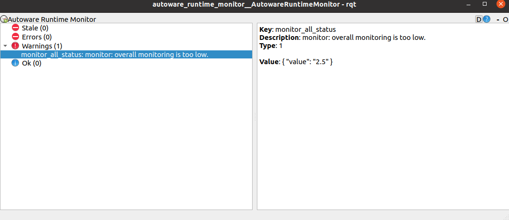

# autoware_runtime_monitor

For Chinese please refer to [简体中文](./README_cn.md)

The rqt based tool to show autoware_system_msgs/NodeStatus.

For msg definitions, please refer [autoware_system_msgs in rosindex](https://index.ros.org/p/autoware_system_msgs/github-autoware-ai-messages/#noetic)

## design



according to the msg definitions, the diagnostic msg has 4 levels: OK, WARN, ERROR, FATAL

if a diagnosic key msg is not updated for over 5 seconds, this key will be marked with **STALE**, it is not a level but will be useful.

## setup

prepare [autoware_system_msgs](https://github.com/Autoware-AI/messages/tree/master/autoware_system_msgs) and [autoware_health_checker](https://github.com/Autoware-AI/common/tree/master/autoware_health_checker)

```sh
rosrun autoware_runtime_monitor autoware_runtime_monitor
```

**note**: this node subscribers topic `/node_status` which is of `autoware_system_msgs::NodeStatus`.

## about autoware diagnostics

Autoware.ai added it's diagnostics in [release1.11](https://github.com/Autoware-AI/autoware.ai/issues/1813) and improved the health_checker in [release1.13](https://discourse.ros.org/t/autoware-ai-1-13-released/11785)

## about autoware failsafe action framework

diagnostics is needed for fault torlerance.

refer [emergency handler and shared memory monitor](https://gitlab.com/autowarefoundation/autoware.ai/common/-/issues/4) for more details
